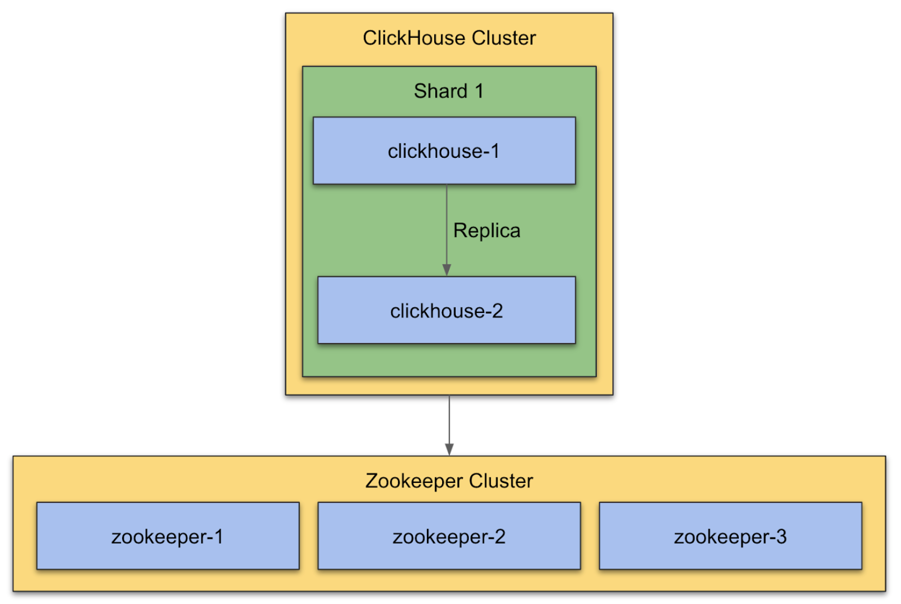

### Setup 2 Node ClickHouse Cluster (1 shard)

The example config files in this folder are using the hostnames from the boxes of the diagram: `clickhouse-1, clickhouse-2, zookeeper-1, ...`.

You can name the hosts however you like. Just make sure to replace the names in the config files that we provide.

