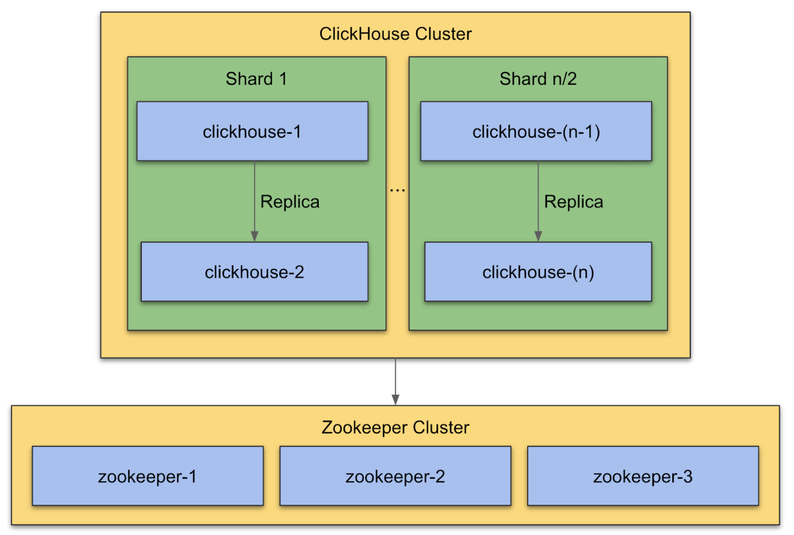

### Setup 4 Node ClickHouse Cluster (2 shards)

Installing a larger ClickHouse cluster with multiple shards is required when the write and query performance are too slow.

The installation steps are identical to the single shard setup. You need to setup a three node ZooKeeper cluster and your `2 * Number of Shards`  ClickHouse hosts. You only need to make a configuration change to the  `dynamic.xml`.

