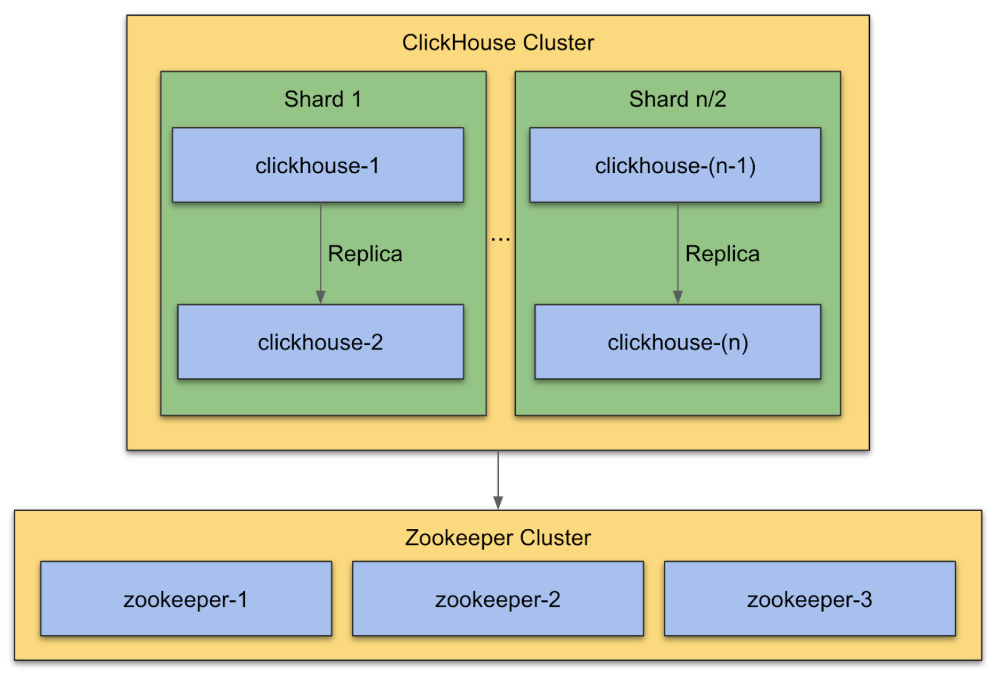

## ClickHouse 18.14.x Configuration

This configuration assumes the following hardware footprint:

- 16 cores
- 64 GB memory
- 6000 IOP SSD volume

> NOTE:
> This is not an exhaustively optimised configuration. It will likely
> change over time. Please seek to understand how configuration updates > made to this repository may impact an already running cluster as they > are not guaranteed to be backwards compatible.

## Prerequisites

- Setup 3 node ZooKeeper cluster, see [Setup ZooKeeper cluster](../zookeeper/README.md)

## Overview

To enable replication in a ClickHouse ZooKeeper is required. ClickHouse will take care of data consistency on all replicas and run restore procedure after failure automatically. It's recommended to deploy ZooKeeper cluster to separate servers. ZooKeeper is very sensitive for latency and ClickHouse may utilize all available system resources.

The following diagram shows a basic setup with 1 shared. Data will be replicated between clickhouse-1 and clickhouse-2. For reliable ZooKeeper service, you should deploy ZooKeeper in a cluster with three nodes. As long as a majority of the ZooKeeper nodes are up, the service will be available. Because ZooKeeper requires a majority, it is best to use an odd number of machines.

### Setup 2 Node ClickHouse Cluster

In the following chapters we will refer to the host names in the blue boxes of the diagram: clickhouse-1, clickhouse-2, zookeeper-1, ...
You can name the hosts however you like. Just make sure to replace the names in the config files that we provide.


### Installation

After installing the ZooKeeper cluster you can install ClickHouse on host clickhouse-1 and clickhouse-2, using the Instana packages.

Debian:
```
apt-get install clickhouse
```

RedHat/CentOS:
```
yum install -y clickhouse
```

### Configuration

- [base-config](base-config) contains basic configuration files
- `1-shard-clickhouse-setup` contains config files for a 2 node clickhouse cluster with 1 shard
- `2-shard-clickhouse-setup` contains config files for a 4 node clickhouse cluster with 2 shards


### Start / Stop ClickHouse service

```
# start clickhouse
systemctl start clickhouse.service

# stop clickhouse
systemctl stop clickhouse.service

# check status of clickhouse
systemctl status clickhouse.service
```

### Check Logs

#### SystemD logs

```
journalctl -fu clickhouse
```

#### Log files

```
tail -f /<path to logs>/clickhouse/clickhouse-server.log
tail -f /<path to logs>/clickhouse/clickhouse-server.err.log
```

### Setup 4 node ClickHouse cluster (2 shards)

Installing a larger ClickHouse cluster with multiple shards is required when the write and query performance are too slow.

The installation steps are identical to the single shard setup. You need to setup a three node ZooKeeper cluster and your 2 * Number of Shards  ClickHouse hosts. You only need to make a configuration change to dynamic.xml from ClickHouse. The configuration file below is an example for a 2 shards, 4 host ClickHouse cluster setup.


