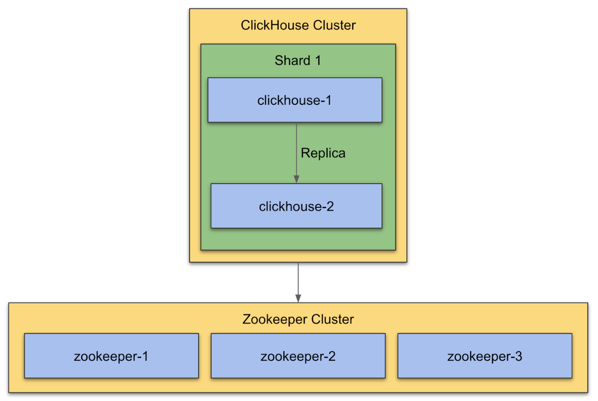

# Install ClickHouse

This configuration assumes the following hardware footprint:

- 16 cores
- 64 GB memory
- 6000 IOP SSD volume

> NOTE:
> This is not an exhaustively optimised configuration. It will likely
> change over time. Please seek to understand how configuration updates > made to this repository may impact an already running cluster as they > are not guaranteed to be backwards compatible.

## Prerequisites

- Setup 3 node ZooKeeper cluster, see [Setup ZooKeeper cluster](../zookeeper/README.md)

## Overview

ClickHouse is an open-source column-oriented DBMS (columnar database management system) for online analytical processing (OLAP).

To enable replication in a ClickHouse ZooKeeper is required. ClickHouse will take care of data consistency on all replicas and run restore procedure after failure automatically. It's recommended to deploy ZooKeeper cluster to separate servers. ZooKeeper is very sensitive for latency and ClickHouse may utilize all available system resources.

The following diagram shows a basic setup with 1 shard. Data will be replicated between `clickhouse-1` and `clickhouse-2`. For a reliable ZooKeeper service, you should deploy ZooKeeper in a cluster with three nodes. As long as a majority of the ZooKeeper nodes are up, the service will be available. Because ZooKeeper requires a majority, it is best to use an odd number of machines.

### Setup 2 Node ClickHouse Cluster

The [config files for the 1 shard setup](1-shard-clickhouse-setup)  are using the hostnames from the boxes of the diagram: `clickhouse-1, clickhouse-2, zookeeper-1, ...`.

You can name the hosts however you like. Just make sure to replace the names in the config files that we provide.



### Installation

After installing the ZooKeeper cluster you can install ClickHouse on host `clickhouse-1` and `clickhouse-2`.

#### Debian/Ubuntu:

```
apt-get install -y clickhouse=21.3.8.76-lts-1
```

#### RedHat/CentOS:

```
yum install -y clickhouse-21.3.8.76_lts-1
```

### Configuration

- [config](config) - contains basic configuration files
- [1-shard-clickhouse-setup](1-shard-clickhouse-setup) - contains config files for a 2 node clickhouse cluster with 1 shard
- [2-shard-clickhouse-setup](2-shard-clickhouse-setup) - contains config files for a 4 node clickhouse cluster with 2 shards

### Start / Stop ClickHouse service

```
# reload configuration
systemctl daemon-reload

# start clickhouse
systemctl start clickhouse.service

# stop clickhouse
systemctl stop clickhouse.service

# check status of clickhouse
systemctl status clickhouse.service
```

### Check Logs

#### SystemD logs

```
journalctl -fu clickhouse
```

#### Log files

```
tail -f /<path to logs>/clickhouse/clickhouse-server.log
tail -f /<path to logs>/clickhouse/clickhouse-server.err.log
```
