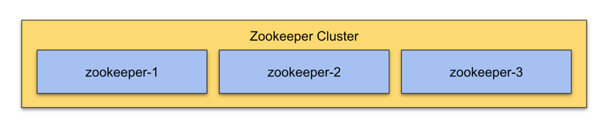

# Configuration files

For a reliable ZooKeeper service, you should deploy ZooKeeper in a cluster with three nodes. As long as a majority of the ZooKeeper nodes are up, the service will be available. Because ZooKeeper requires a majority, it is best to use an odd number of machines.



## java.env

Filepath: `/etc/zookeeper/java.env`

2 node ClickHouse cluster. Depending on the workload you need to provide the ZooKeeper JVM enough memory

```
export JVMFLAGS="-Xmx2048m -XX:+UseParNewGC -XX:+UseConcMarkSweepGC -XX:+CMSParallelRemarkEnabled"
```

12 node ClickHouse cluster we use the following setting

```
export JVMFLAGS="-Xmx10240m -XX:+UseParNewGC -XX:+UseConcMarkSweepGC -XX:+CMSParallelRemarkEnabled"
```

## zoo.cfg

Filepath: `/etc/zookeeper/zoo.cfg`

Variables:
- ${ DATA_DIRECTORY }, i.e. `/mnt/data/zookeeper/`
- ${ INDEX_ZK_NODE_ONE }, i.e. `1`
- ${ ZK_HOSTNAME_ONE }, i.e. `10.10.50.101`
- ${ INDEX_ZK_NODE_TWO }, i.e. `2`
- ${ ZK_HOSTNAME_TWO }, i.e. `10.10.50.102`
- ${ INDEX_ZK_NODE_THREE }, i.e. `3`
- ${ ZK_HOSTNAME_THREE }, i.e. `10.10.50.103`
